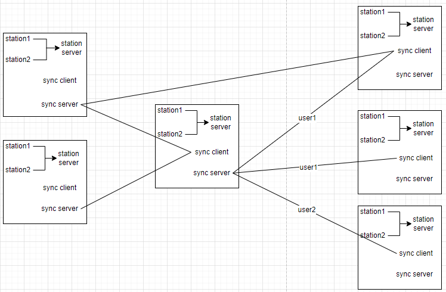
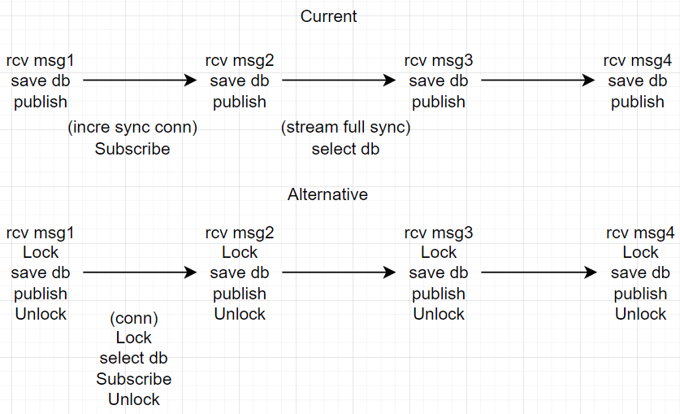

[Client's README](tide_client/README.md)

[Server's README](tide_server/README.md)

[uart-tcp-forward's README](uart-tcp-forward/README.md)

# Architecture

# Sync

There are two mechanisms to synchronisation:
1. Pub/Sub Event Polling, basically downstream deployments poll data from upstreams.
2. Full DB query when live connection breaks and needs to resync: Last received data time stamp is compared to DB upstreams.

