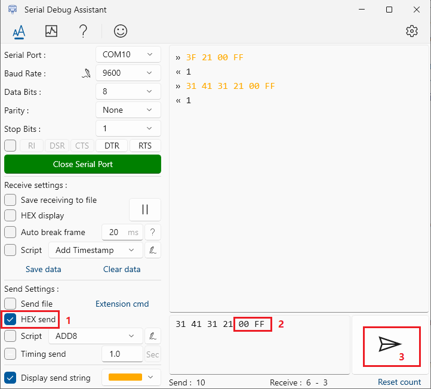

<!-- TOC -->
* [1. What do you need](#1-what-do-you-need)
* [2. Prerequisite](#2-prerequisite)
  * [2.1. Ftp Server](#21-ftp-server)
  * [2.2. Syncthing](#22-syncthing)
* [3. Flash Arduino](#3-flash-arduino)
* [4. Init sqlite database tables](#4-init-sqlite-database-tables)
* [5. Build client on wsl2 or Linux](#5-build-client-on-wsl2-or-linux)
* [6. Install as service](#6-install-as-service)
* [7. Determine location of the usb serial device](#7-determine-location-of-the-usb-serial-device)
  * [7.1. Checkout which id is the USB serial device we just inserted](#71-checkout-which-id-is-the-usb-serial-device-we-just-inserted)
* [8. Sensor Init](#8-sensor-init)
  * [8.1. RS485](#81-rs485)
    * [8.1.1. HMP155](#811-hmp155)
    * [8.1.2. PWD50](#812-pwd50)
    * [8.1.3. WMT700](#813-wmt700)
  * [8.2. SDI-12](#82-sdi-12)
    * [8.2.1. PLS-C](#821-pls-c)
    * [8.2.2. SE200](#822-se200)
* [9. Sensor Wiring](#9-sensor-wiring)
  * [9.1. RS485](#91-rs485)
  * [9.2. SDI-12](#92-sdi-12)
  * [9.3. Analog (connected to arduino)](#93-analog-connected-to-arduino)
  * [9.4. GPIO (connected to raspberry pi)](#94-gpio-connected-to-raspberry-pi)
<!-- TOC -->

# 1. What do you need

- Raspberry Pi 4 Model B
- SanDisk 256GB MAX Endurance microSD Card
- Arduino Uno (for SDI-12 and anolog read use)
- Usb to rs485
- Rs485 Hub (Optional)

# 2. Prerequisite

- Fix all device IPs (Raspberry Pi and camera) on the router, or use hostname to connect to each other.
- Ftp server
- Syncthing (Used to synchronize camera photos)

## 2.1. Ftp Server

1. `sudo apt install vsftpd`
2. Setting monitor camera's ftp config

## 2.2. Syncthing

1. Following https://docs.syncthing.net/users/autostart.html
2. Change "gui.address" to `:8384` in `~/.config/syncthing/config.xml`

   ```xml
   <gui enabled="true" tls="false" debugging="false">
       <address>:8384</address>
       <apikey>NfKpteqfsVrTdRKeKdzLoWLcTfeScboy</apikey>
       <theme>default</theme>
   </gui>
   ```

3. Add Service by `Add Remote Device`
4. Add ftp directory by `Add Folder`

**For example:**

1. Raspberry pi side:

   

2. Server side:

   The server side "Folder Path" must be the "tide.camera.storage" in config.json + station's uuid(get from the
   **stations** table in the database, or get it through the station details page URL. e.g.`https://oceans.navi-tech.net/#/stationDetail/1048a910-2a2b-11eb-9abd-d89ef3266df6`).
   

# 3. Flash Arduino

Check [README.md](../arduino/README.md)

# 4. Init sqlite database tables

```shell
pi@raspberrypi:~ $ sqlite3 /home/pi/tide/data.db
SQLite version 3.34.1 2021-01-20 14:10:07
Enter ".help" for usage hints.
sqlite> .read tide_client/schema.sql
```

# 5. Build client on wsl2 or Linux

```shell
# Raspberry Pi OS (32-bit)
apt install gcc-arm-linux-gnueabihf
CC='arm-linux-gnueabihf-gcc' GOARCH='arm' GOARM=7 go build

# Raspberry Pi OS (64-bit)
apt install gcc-aarch64-linux-gnu
CC='aarch64-linux-gnu-gcc' GOARCH='arm64' go build
```

```shell
pi@raspberrypi:~/tide $ ./tide_client -h
Usage of ./tide_client:
  -config string
        Config file (default "config.json")
  -log string
        log level (default "debug")
```

# 6. Install as service

```shell
sudo cp tidegauge.service /etc/systemd/system
```

Then start the service `sudo systemctl enable --now tidegauge.service`

# 7. Determine location of the usb serial device

```shell
pi@raspberrypi:~ $ ls -l /dev/serial/by-id/
total 0
lrwxrwxrwx 1 root root 13 Sep  6 19:04 usb-Arduino__www.arduino.cc__0043_9573535303235170C020-if00 -> ../../ttyACM0
```

## 7.1. Checkout which id is the USB serial device we just inserted

```
pi@raspberrypi:~ $ dmesg
...
[1211472.086501] usb 1-1.3: new full-speed USB device number 44 using xhci_hcd
[1211472.201583] usb 1-1.3: New USB device found, idVendor=2341, idProduct=0043, bcdDevice= 0.01
[1211472.201605] usb 1-1.3: New USB device strings: Mfr=1, Product=2, SerialNumber=220
[1211472.201618] usb 1-1.3: Manufacturer: Arduino (www.arduino.cc)
[1211472.201629] usb 1-1.3: SerialNumber: 9573535303235170C020
[1211472.209045] cdc_acm 1-1.3:1.0: ttyACM0: USB ACM device
```

Then you can configure the `port` in the configuration to `/dev/serial/by-id/usb-Arduino__www.arduino.cc__0043_9573535303235170C020-if00`.

# 8. Sensor Init

Install [Serial Debug Assistant](https://www.microsoft.com/store/productId/9NBLGGH43HDM?ocid=pdpshare).

## 8.1. RS485

1. Setting sensor mode to "POLL"
2. Setting sensor baud-rate to 9600, data-bits to 7, parity to "E", stop-bits to 1.
3. Setting sensor address same with the address in config.

### 8.1.1. HMP155

```
smode POLL
seri 9600 e 7 1
addr 5
```


### 8.1.2. PWD50

```
CONF // When asked about Unit id characters, set it to "1". For other items, just press Enter.
```


### 8.1.3. WMT700

```
$0OPEN<CR><LF> // Enter the configuration mode
S address,2<CR><LF> // Setting sensor address to "2"
BAUD 9600,7,e,1
```


## 8.2. SDI-12

This step will set sensor address same with the address in config.

First you need to configure the Serial Debug Assistant to connect to the arduino.


### 8.2.1. PLS-C

```
?! // Query the sensor address
aA1! // Change the sensor address from "a" to "1".("a" is the address returned in the previous step)
```

1. Type "?!", then check "HEX send", then type "00 FF", then click send.
   
   
2. Type "1A1!", then check "HEX send", then type "00 FF", then click send.
   
   

### 8.2.2. SE200

```
?! // Query the sensor address
aA2! // Change the sensor address from "a" to "2".("a" is the address returned in the previous step)
```

1. Type "?!", then check "HEX send", then type "00 FF", then click send.
   
   
2. Type "2A2!", then check "HEX send", then type "00 FF", then click send.
   
   

# 9. Sensor Wiring

## 9.1. RS485

| RS485  | A            | B     | VCC   | GND       |
|--------|--------------|-------|-------|-----------|
| HMP155 | pink         | brown | blue  | red       |
| PWD50  | brown        | white | red   | black     |
| WMT700 | brown-yellow | black | white | gray-pink |

## 9.2. SDI-12

Data line connect to the D7 pin of the arduino.

| SDI-12 | VCC   | GND   | DATA   | SDI-12 GND |
|--------|-------|-------|--------|------------|
| SE200  | brown | white | yellow | green      |
| PLS-C  | red   | blue  | gray   |            |

## 9.3. Analog (connected to arduino)

DRD11A: yellow wire connects to the A0 pin of the arduino.

## 9.4. GPIO (connected to raspberry pi)

DRD11A: blue wire connects to the GPIO 17 pin of the raspberry pi.(Check Raspberry Pi PinOut at https://pinout.xyz/)


