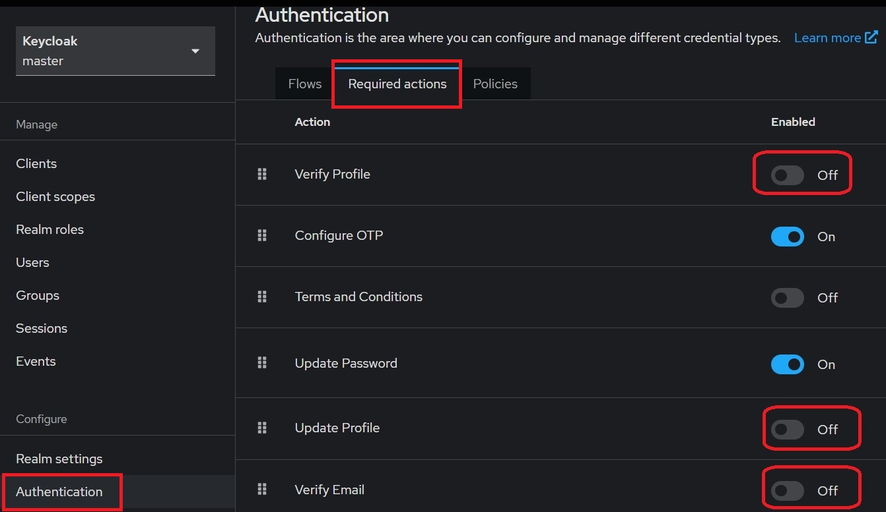

- [1. Prerequisite](#1-prerequisite)
- [2. Install third party](#2-install-third-party)
- [3. Init postgresql database](#3-init-postgresql-database)
- [4. Build](#4-build)
    - [4.1. Windows or Linux](#41-windows-or-linux)
    - [4.2. Docker](#42-docker)
- [5. Run](#5-run)
    - [5.1. Linux Service](#51-linux-service)
    - [5.2. Windows Service](#52-windows-service)
    - [5.3. Docker](#53-docker)
- [6. Sync v2 (HTTP Upgrade over same port)](#6-sync-v2-http-upgrade-over-same-port)

# 1. Prerequisite

- Postgresql
- Syncthing
- Keycloak

# 2. Install third party

## 2.1. Postgresql

Following https://www.postgresql.org/download/

## 2.2. Keycloak

Following https://www.keycloak.org/guides#getting-started

Edit `conf/keycloak.conf` to use postgresql as database.

Create a realm named `tidegauge` and a client named `myclient`.

Disable some required actions:



## 2.3. Syncthing

Following https://docs.syncthing.net/users/autostart.html

# 3. Init postgresql database

`psql -d tidegauge -U postgres -f tide_server/schema.sql`

# 4. Build

## 4.1. Windows or Linux

`go build`

```shell
$ ./tide_server -h
Usage of ./tide_server:
  -config string
        Config file (default "config.json")
  -debug
        debug mode (default true)
  -dir string
        working dir (default ".")
```

## 4.2. Docker

```shell
docker build -f tide_server/Dockerfile -t wwnt/tide-server .
```

# 5. Run

## 5.1. Linux Service

```shell
cp tidegauge.service /etc/systemd/system
sudoedit /etc/systemd/system/tidegauge.service
# change USER,GROUP,WorkingDirectory,ExecStart to your own
```

## 5.2. Windows Service

```shell
New-Service -Name "tide" -BinaryPathName "E:\tide\tide_server.exe -dir E:\tide" -StartupType "AutomaticDelayedStart"
```

## 5.3. Docker

```yaml
version: "3"
services:
  tide-server:
    image: wwnt/tide-server
    container_name: tide-server
    volumes:
      - ./docker:/var/tide_server
    ports:
      - "7100:7100"
      - "7102:7102"
    restart: unless-stopped
```

# 6. Sync v2 (HTTP Upgrade over same port)

Sync v2 can run on the same `listen` address as existing HTTP APIs.

```json
{
  "listen": ":7100",
  "sync_v2": {
    "enabled": true
  }
}
```

Routes and modules:

- `POST /sync_v2/station`: station sync ingress, registered in `tide_server/controller/router.go`
- `POST /sync_v2/relay`: relay sync ingress, also registered in `tide_server/controller/router.go`
- `tide_server/controller/syncv2_adapters.go`: injects database, hub, auth and permission dependencies into the v2 packages
- `tide_server/syncv2/station/*`: station-side handler, session registry and storage logic
- `tide_server/syncv2/relay/*`: upstream server and downstream client logic for server-to-server sync

Relay authentication:

For server-to-server relay (`tide_server -> tide_server`), downstream first logs in with the configured upstream account (`upstreams.username/password`) at `POST /login`, then connects to `POST /sync_v2/relay` with `Authorization: Bearer <access_token>`. The upstream applies that authenticated account's permissions when filtering synchronized data.

Station sync notes:

- station sync does not use bearer tokens
- camera snapshot requests reuse the existing camera HTTP API; when a station has a live v2 connection, the server prefers the v2 command stream to fetch the snapshot

Related docs:

- [Server API guide](../docs/server/api-guide.md)
- [Sync V2 protocol](../docs/protocols/sync-v2-protocol.md)

